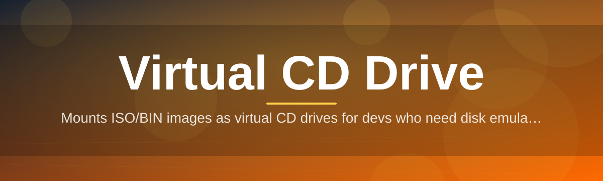

# virtual-cd-drive-manager 💿🖥️

  

*Mount, manage, and vanish disc images without ever touching a physical drive again.*

  

---

## 📀 Overview

Optical drives are dying hardware on living workflows. ISOs, BIN/CUE pairs, and legacy disc images still gatekeep installers, archived software, and old-school game libraries — but the tray-loading drive that used to read them is gone from every modern laptop. **virtual-cd-drive-manager** closes that gap by emulating a CD/DVD drive entirely in software, presenting disc images to Windows exactly as if a physical disc had been inserted.

This isn't a bloated disc-burning suite wearing a virtual drive as a side feature. It's a purpose-built manager: mount an image, get a drive letter, done. No image conversion tax, no forced re-encoding, no nagging toolbars. It exists for sysadmins archiving install media, developers testing autorun behavior, retro-software hobbyists, and anyone who still owns a folder full of `.iso` files and no way to open them.

Built for 2026's Windows landscape — lean, driver-level virtual mounting, and a UI that gets out of your way. If your workflow touches disc images more than twice a month, this tool earns its spot in your startup tray.

---

## ⚡ What It Actually Does

> [!TIP]
> Every capability below runs without admin-mode nagging after the first driver handshake — approve once, mount forever.

- **Instant image mounting** — drop in ISO, BIN/CUE, IMG, or NRG files and get a live virtual CD drive letter in under two seconds.

- **Multi-drive emulation** — spin up several virtual optical drives simultaneously, each bound to a different image, for batch testing or multi-title libraries.

- **Autorun fidelity** — preserves autorun.inf behavior so legacy installers and menu-driven discs launch exactly like they would from a real tray.

- **Zero-footprint unmounting** — eject virtually, and the drive letter disappears cleanly with no orphaned mount points or registry litter.

- **Image library shelf** — a persistent panel that remembers your recently mounted images so re-mounting a title is a double-click, not a file hunt.

- **Format-agnostic reading** — handles compressed and raw disc image containers without forcing a conversion pass first.

- **Silent background service** — the mounting engine runs as a lightweight background process; the GUI is optional chrome, not a requirement.

- **Portable profile mode** — carry your mount list and settings on a USB stick between machines without reinstalling anything.

---

## 🚀 Getting Off the Ground

1. Visit the landing page via the download button above.

2. Grab the latest signed build for your Windows version.

3. Run the installer — it registers the virtual drive driver and places an icon in your system tray.

4. Right-click any `.iso`/`.bin`/`.img` file, choose **Mount with virtual-cd-drive-manager**, and a new drive letter appears in File Explorer.

> [!NOTE]
> First launch triggers a one-time Windows driver signature prompt. This is expected — the virtual drive kernel component needs that handshake to register.

---

## 🧩 Requirements Matrix

| Component | Minimum | Recommended |
|---|---|---|
| **OS** | Windows 10 (64-bit, build 1909+) | Windows 11 (latest patch) |
| **RAM** | 2 GB | 4 GB+ |
| **Disk** | 50 MB free (app) + image size | 200 MB free for library caching |
| **Dependencies** | None — fully standalone | None |
| **Privileges** | Admin rights for first-run driver setup | Standard user afterward |

  

---

## 🛠️ How It Works

The manager sits between your file system and Windows' storage stack, translating a static image file into a device Windows believes is spinning.

1. **Select** an image file through the app or right-click context menu.

2. **Parse** — the engine reads the image's table of contents and sector layout.

3. **Register** a virtual optical device with the Windows storage subsystem.

4. **Mount** the device, assigning it a drive letter like any physical disc.

5. **Serve** read requests directly from the image file, in real time, until ejected.

> [!IMPORTANT]
> The virtual device is read-only by design. This tool emulates disc *reading*, not disc *writing* or duplication.

---

## 🧯 Troubleshooting

<strong>The mounted drive shows up but Explorer says it's empty.</strong>

Usually a corrupted or truncated image file. Re-verify the source file's checksum before remounting — the virtual drive can only serve what the image actually contains.

<strong>Driver installation fails on first run.</strong>

Run the installer as Administrator once. After the kernel driver registers successfully, subsequent mounts work under a standard user account.

<strong>Autorun doesn't trigger on mount.</strong>

Windows disabled autorun-on-insert by default since Windows 8. This is an OS-level policy, not a limitation of the virtual drive itself — enable AutoPlay in Windows Settings if you need that legacy behavior.

<strong>Can I mount BIN/CUE pairs directly?</strong>

Yes — point the mounter at the `.cue` file and it will locate the matching `.bin` automatically if both sit in the same folder.

<strong>The tray icon disappeared after a Windows update.</strong>

Relaunch the app once from the Start Menu; Windows updates occasionally reset startup-app registrations. Re-enable "Start with Windows" in Settings to restore it permanently.

> [!WARNING]
> Mounting extremely large image files (25GB+) from a network drive introduces latency during the parse step. Local storage is strongly recommended for large titles.

---

## 🎛️ UI, Shortcuts & Personality

The interface favors muscle memory over menu-diving.

| Shortcut | Action |
|---|---|
| `Ctrl + M` | Mount an image |
| `Ctrl + E` | Eject active drive |
| `Ctrl + Shift + E` | Eject all mounted drives |
| `Ctrl + L` | Open recent image library |
| `F2` | Rename a mounted drive label |

- **Themes** — Light, Dark, and an auto mode that follows Windows' system theme.

- **Compact tray mode** — collapse the main window into a system tray dropdown for one-click mounting.

- **Drive label memory** — assign custom volume labels that persist across remounts of the same image.

> [!TIP]
> Pin your three most-used images to the tray menu via drag-and-drop for zero-click mounting.

---

## 🤝 Contributing & Community

Bug reports, feature requests, and pull requests are welcome — this project grows through the people actually mounting discs at 2 AM trying to install something from 2004.

- Open an issue describing the image format or behavior that broke.

- Fork, branch, and submit a pull request against `main`.

- Join discussions on architecture before large changes — the virtual drive core is intentionally minimal, and we like it that way.

> Every contribution, however small, keeps optical media relevant one virtual sector at a time.

---

## 📄 License

Released under the [MIT License](LICENSE), 2026.

---

## ⚠️ Disclaimer

virtual-cd-drive-manager is provided for legitimate use with disc images you own or have rights to access — archived personal media, legally distributed installers, and self-authored images. The maintainers assume no responsibility for misuse. This project emulates hardware behavior; it does not circumvent copy protection, licensing checks, or any digital rights management system.

